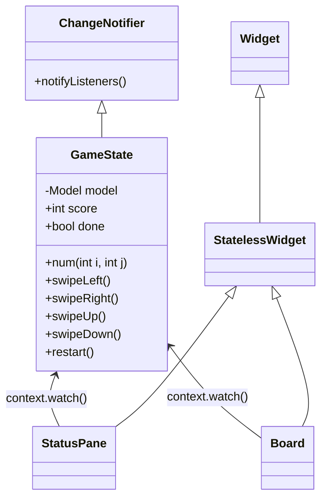

## 1. Foreword

I want to develop a little game. It's amazing, right? Nowadays, we have several options for developing rich clients or apps. Cross-platform is an amazing feature that every developer dreams of, I guess. Among the multiple options, flutter and react-native stand out with no doubt. I chose Flutter as I am very familiar with Java which is similar to Dart, the programming language for Flutter. 

In this article, I'll show you how to develop a 2048 game in Flutter step by step.

## 2. Introduction to 2048

2048 is a popular sliding tile puzzle game. The rule is simple: each time you can swipe left, right, up, or down; try your best to get the tile with the number 2048.

{width=300}

## 3. Preparation

First, we need a computer, of course. It's a laptop for me. We also need to know enough about [Dart programming language](https://dart.dev/overview).

Second, set up the development environment. Refer to https://docs.flutter.dev/get-started/install .

Third, choose your favorite IDE, I prefer `Visual Studio Code` (VSCode).

## 4. Programming

### 4.1 Create a Flutter project

Open a terminal, use the following command to create the project

```sh
flutter create -e g2048
```

Here, `g2048` is the project name.

We can also create it using VSCode. Go `View > Command Palette`, type `flutter`, then click `Flutter: New Project`, and then click `Empty Application`. 

Now we have a `Hello World` app. Great! Run `flutter run` and we'll see it.


### 4.2 Graphic User Interface

We're going to implement a simple GUI like

```txt
2048  | Score
          0
 -----------
|           |               
|   Board   |  
|   (4x4)   |  
|           |  
 -----------
```

Let's say it in Flutter language:

{ width=300 }

{ width=300 }

#### 4.2.1 lib/src/status_pane.dart (draft)

Let's create the first Widget `StatusPane` which is stateless.

``` {.dart .copy linenums="1"} 
import 'package:flutter/material.dart';

class StatusPane extends StatelessWidget {
  const StatusPane({
    super.key,
  });

  @override
  Widget build(BuildContext context) {
    var theme = Theme.of(context).textTheme;
    return Row(
      mainAxisAlignment: MainAxisAlignment.spaceAround,
      children: [
        Text('2048', style: _textStyle(theme.displayLarge!)),
        Column(
          children: [
            Text('SCORE', style: _textStyle(theme.bodyMedium!)),
            // TODO score
            Text('0', style: _textStyle(theme.displayMedium!)),
          ],
        ),
      ],
    );
  }

  TextStyle _textStyle(TextStyle style) {
    return style.copyWith(
      color: Colors.brown,
      fontWeight: FontWeight.bold,
    );
  }
}
```

#### 4.2.2 lib/src/board.dart (draft)

Next, let's create another Widget `Board` which is also stateless.

``` {.dart .copy linenums="1"}
import 'package:flutter/material.dart';

class Board extends StatelessWidget {
  const Board({super.key});

  @override
  Widget build(BuildContext context) {
    var theme = Theme.of(context);
    return Container(
      width: 374,
      height: 374,
      decoration: const BoxDecoration(
        color: Colors.brown,
        borderRadius: BorderRadius.all(Radius.circular(4 * 4)),
      ),
      child: _board(theme),
    );
  }

  Widget _board(ThemeData theme) {
    return Column(
      mainAxisAlignment: MainAxisAlignment.center,
      children: [
        for (var i = 0; i < 4; i++)
          Row(
            mainAxisAlignment: MainAxisAlignment.center,
            children: [
              for (var j = 0; j < 4; j++)
                Tile(
                  num: 0, // TODO
                  theme: theme,
                )
            ],
          )
      ],
    );
  }
}

class Tile extends StatelessWidget {
  const Tile({
    super.key,
    required this.num,
    required this.theme,
  });

  final int num;
  final ThemeData theme;

  @override
  Widget build(BuildContext context) {
    return Container(
      width: 81,
      height: 81,
      margin: const EdgeInsets.all(4),
      decoration: BoxDecoration(
        color: Colors.brown.shade400,
        borderRadius: const BorderRadius.all(Radius.circular(4)),
      ),
      child: Align(
        alignment: Alignment.center,
        child: Text(
          num > 0 ? '$num' : '',
          style: theme.textTheme.displayMedium!.copyWith(
            fontWeight: FontWeight.bold,
            color: Colors.black54,
            fontSize: theme.textTheme.displayMedium!.fontSize!,
          ),
        ),
      ),
    );
  }
}
```

#### 4.2.3 lib/main.dart (draft)

Let's update `main.dart`. And then run `flutter run` or click `Run > Run Without Debugging` in VSCode.

``` {.dart .copy linenums="1"}
import 'package:flutter/material.dart';
import 'package:g2048/src/board.dart';
import 'package:g2048/src/status_pane.dart';

void main() {
  runApp(const MyApp());
}

class MyApp extends StatelessWidget {
  const MyApp({super.key});

  // This widget is the root of your application.
  @override
  Widget build(BuildContext context) {
    return MaterialApp(
      title: '2048',
      theme: ThemeData(
        colorScheme: ColorScheme.fromSeed(seedColor: Colors.brown),
        useMaterial3: true,
      ),
      home: const HomeScreen(),
    );
  }
}

class HomeScreen extends StatelessWidget {
  const HomeScreen({super.key});

  @override
  Widget build(BuildContext context) {
    return const Scaffold(
      body: Center(
        child: Column(
          mainAxisAlignment: MainAxisAlignment.center,
          children: [
            StatusPane(),
            SizedBox(height: 81 / 2),
            Board(),
          ],
        ),
      ),
    );
  }
}
```

#### 4.2.4 First refactor

We have created or edited three files now:
- `lib/main.dart`
- `lib/src/status_pane.dart`
- `lib/src/board.dart`

And there are several common constant values among these files. Why don't we define them in a file that other files can include? This way, we have at least the benefit of avoiding hard-code.

???+ note  "lib/src/constants.dart"

    ```dart
    import 'package:flutter/material.dart';

    const kTileSize = 81.0;
    const kMainColor = Colors.brown;
    const kMargin = 4.0;
    ```

??? note "lib/src/status_pane.dart"

    ``` {.dart .copy linenums="1" hl_lines="29"}
    import 'package:flutter/material.dart';
    import 'package:g2048/src/constants.dart';
    
    class StatusPane extends StatelessWidget {
      const StatusPane({
        super.key,
      });
    
      @override
      Widget build(BuildContext context) {
        var theme = Theme.of(context).textTheme;
        return Row(
          mainAxisAlignment: MainAxisAlignment.spaceAround,
          children: [
            Text('2048', style: _textStyle(theme.displayLarge!)),
            Column(
              children: [
                Text('SCORE', style: _textStyle(theme.bodyMedium!)),
                // TODO score
                Text('0', style: _textStyle(theme.displayMedium!)),
              ],
            ),
          ],
        );
      }
    
      TextStyle _textStyle(TextStyle style) {
        return style.copyWith(
          color: kMainColor,
          fontWeight: FontWeight.bold,
        );
      }
    }
    ```

??? note "lib/src/board.dart"

    ``` {.dart .copy linenums="1" hl_lines="14 15 56 59"}
    import 'package:flutter/material.dart';
    import 'package:g2048/src/constants.dart';
    
    class Board extends StatelessWidget {
      const Board({super.key});
    
      @override
      Widget build(BuildContext context) {
        var theme = Theme.of(context);
        return Container(
          width: 374,
          height: 374,
          decoration: const BoxDecoration(
            color: kMainColor,
            borderRadius: BorderRadius.all(Radius.circular(4 *  kMargin)),
          ),
          child: _board(theme),
        );
      }
    
      Widget _board(ThemeData theme) {
        return Column(
          mainAxisAlignment: MainAxisAlignment.center,
          children: [
            for (var i = 0; i < 4; i++)
              Row(
                mainAxisAlignment: MainAxisAlignment.center,
                children: [
                  for (var j = 0; j < 4; j++)
                    Tile(
                      num: 0, // TODO
                      theme: theme,
                    )
                ],
              )
          ],
        );
      }
    }
    
    class Tile extends StatelessWidget {
      const Tile({
        super.key,
        required this.num,
        required this.theme,
      });
    
      final int num;
      final ThemeData theme;
    
      @override
      Widget build(BuildContext context) {
        return Container(
          width: kTileSize,
          height: kTileSize,
          margin: const EdgeInsets.all(kMargin),
          decoration: BoxDecoration(
            color: Colors.brown.shade400,
            borderRadius: const BorderRadius.all(Radius.circular(kMargin)),
          ),
          child: Align(
            alignment: Alignment.center,
            child: Text(
              num > 0 ? '$num' : '',
              style: theme.textTheme.displayMedium!.copyWith(
                fontWeight: FontWeight.bold,
                color: Colors.black54,
                fontSize: theme.textTheme.displayMedium!.fontSize!,
              ),
            ),
          ),
        );
      }
    }
    ```

??? node "lib/main.dart"

    ``` {.dart .copy linenums="1" hl_lines="19 38"}
    import 'package:flutter/material.dart';
    import 'package:g2048/src/board.dart';
    import 'package:g2048/src/constants.dart';
    import 'package:g2048/src/status_pane.dart';
    
    void main() {
      runApp(const MyApp());
    }
    
    class MyApp extends StatelessWidget {
      const MyApp({super.key});
    
      // This widget is the root of your application.
      @override
      Widget build(BuildContext context) {
        return MaterialApp(
          title: '2048',
          theme: ThemeData(
            colorScheme: ColorScheme.fromSeed(seedColor: kMainColor),
            useMaterial3: true,
          ),
          home: const HomeScreen(),
        );
      }
    }
    
    class HomeScreen extends StatelessWidget {
      const HomeScreen({super.key});
    
      @override
      Widget build(BuildContext context) {
        return const Scaffold(
          body: Center(
            child: Column(
              mainAxisAlignment: MainAxisAlignment.center,
              children: [
                StatusPane(),
                SizedBox(height: kTileSize / 2),
                Board(),
              ],
            ),
          ),
        );
      }
    }
    ```

### 4.3 Game State

We've just finished a draft version of GUI. It's time to consider the game state, which is the model of this app. 

#### 4.3.1 lib/src/types.dart

For convenience, let's define types first.

```dart
typedef Model = List<List<int>>;
typedef Point = ({int x, int y});
```

#### 4.3.2 What's the state of this app?

Now let's think about what the state of this app is.

- Data
    * score
    * (4x4) numbers (Model)
- Behaviors(methods) that'll change the above data
    * Swipe left/right/up/down
    * Restart
- Functions(methods) for UI
    * The number at row `i`, column `j`  

It comes out with the following diagram.



#### 4.3.3 lib/src/game_state.dart (draft)

``` {.dart .copy linenums="1"}
import 'package:flutter/material.dart';
import 'package:g2048/src/constants.dart';
import 'package:g2048/src/types.dart';

const _rank = 4;

class GameState extends ChangeNotifier {
  GameState()
      : _model = List.generate(
          _rank,
          (_) => List.filled(_rank, 0, growable: false),
          growable: false,
        ) {
    _init();
  }

  int get size => _rank;
  double get boardSize => size * (kTileSize + 3 * kMargin);

  final Model _model;
  int score = 0;
  bool done = false;

  void _init() {
    _model[size - 1][0] = 2;
    _model[size - 2][0] = 2;
  }

  void _reset() {
    for (var i = 0; i < size; i++) {
      for (var j = 0; j < size; j++) {
        _model[i][j] = 0;
      }
    }
    score = 0;
    done = false;
  }

  void restart() {
    _reset();
    _init();
    notifyListeners();
  }

  int num(int i, int j) => _model[i][j];

  void swipeLeft() {
    // TODO
  }

  void swipeRight() {
    // TODO
  }

  void swipeUp() {
    // TODO
  }

  void swipeDown() {
    // TODO
  }
}
```


#### 4.3.4 Inject the `GameState` into Widgets

We're going to use [`provider`](https://pub.dev/packages/provider) to manage object dependencies.
Run the following command to add the `provider` package.

```sh
flutter pub add provider
```

??? note "lib/main.dart"

    ```{.dart .copy linenums="1" hl_lines="4 6 26 27 28"}
    import 'package:flutter/material.dart';
    import 'package:g2048/src/board.dart';
    import 'package:g2048/src/constants.dart';
    import 'package:g2048/src/game_state.dart';
    import 'package:g2048/src/status_pane.dart';
    import 'package:provider/provider.dart';
    
    void main() {
      runApp(const MyApp());
    }
    
    class MyApp extends StatelessWidget {
      const MyApp({super.key});
    
      // This widget is the root of your application.
      @override
      Widget build(BuildContext context) {
        return MaterialApp(
          title: '2048',
          theme: ThemeData(
              colorScheme: ColorScheme.fromSeed(seedColor:     kMainColor),
              useMaterial3: true,
              bottomSheetTheme: const BottomSheetThemeData(
                backgroundColor: Colors.transparent,
              )),
          home: ChangeNotifierProvider(
            create: (context) => GameState(),
            child: const HomeScreen(),
          ),
        );
      }
    }
    
    // class HomeScreen extends StatelessWidget {
    // ... ...
    ```

??? note "lib/src/status_pane.dart"

    ```{.dart .copy linenums="1" hl_lines="3 4 13 22"}
    import 'package:flutter/material.dart';
    import 'package:g2048/src/constants.dart';
    import 'package:g2048/src/game_state.dart';
    import 'package:provider/provider.dart';
    
    class StatusPane extends StatelessWidget {
      const StatusPane({
        super.key,
      });
    
      @override
      Widget build(BuildContext context) {
        var state = context.watch<GameState>();
        var theme = Theme.of(context).textTheme;
        return Row(
          mainAxisAlignment: MainAxisAlignment.spaceAround,
          children: [
            Text('2048', style: _textStyle(theme.displayLarge!)),
            Column(
              children: [
                Text('SCORE', style: _textStyle(theme.    bodyMedium!)),
                Text('${state.score}', style: _textStyle(theme.    displayMedium!)),
              ],
            ),
          ],
        );
      }
    
      TextStyle _textStyle(TextStyle style) {
        return style.copyWith(
          color: kMainColor,
          fontWeight: FontWeight.bold,
        );
      }
    }
    ```

??? note "lib/src/board.dart"

    ```{.dart .copy linenums="1" hl_lines="3 4 11 14 15 20 27 31 33"}
    import 'package:flutter/material.dart';
    import 'package:g2048/src/constants.dart';
    import 'package:g2048/src/game_state.dart';
    import 'package:provider/provider.dart';
    
    class Board extends StatelessWidget {
      const Board({super.key});
    
      @override
      Widget build(BuildContext context) {
        var state = context.watch<GameState>();
        var theme = Theme.of(context);
        return Container(
            width: state.boardSize,
            height: state.boardSize,
            decoration: const BoxDecoration(
              color: kMainColor,
              borderRadius: BorderRadius.all(Radius.circular(4 *     kMargin)),
            ),
            child: _board(state, theme));
      }
    
      Widget _board(GameState state, ThemeData theme) {
        return Column(
          mainAxisAlignment: MainAxisAlignment.center,
          children: [
            for (var i = 0; i < state.size; i++)
              Row(
                mainAxisAlignment: MainAxisAlignment.center,
                children: [
                  for (var j = 0; j < state.size; j++)
                    Tile(
                      num: state.num(i, j),
                      theme: theme,
                    ),
                ],
              )
          ],
        );
      }
    }
    
    // class Tile extends StatelessWidget {
    // ... ...  
    ```


(to be continued...)


