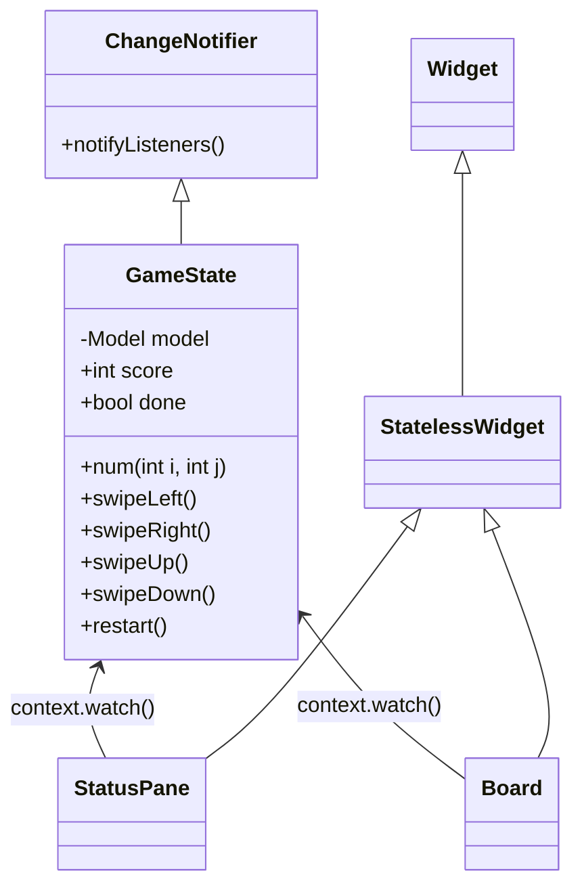
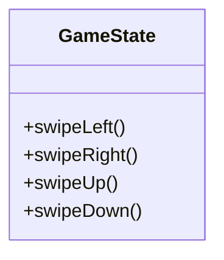
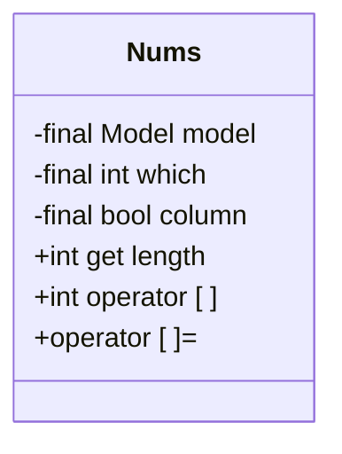
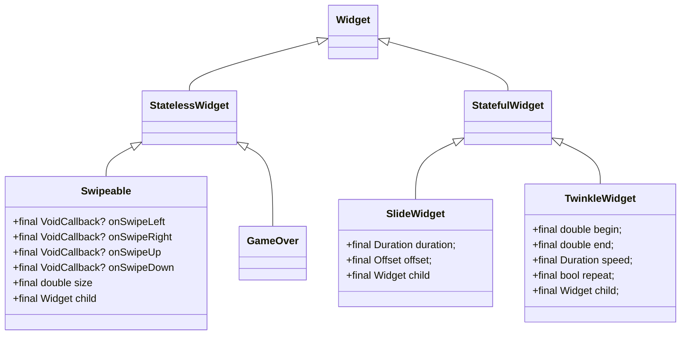

## 1. Foreword

I want to develop a little game. It's amazing, right? Nowadays, we have several options for developing rich clients or apps. Cross-platform is an amazing feature that every developer dreams of, I guess. Among the multiple options, flutter and react-native stand out with no doubt. I chose Flutter as I am very familiar with Java which is similar to Dart, the programming language for Flutter. 

In this article, I'll show you how to develop a 2048 game in Flutter step by step.

## 2. Introduction to 2048

2048 is a popular sliding tile puzzle game. The rule is simple: each time you can swipe left, right, up, or down; try your best to get the tile with the number 2048.

{width=300}

## 3. Preparation

First, we need a computer, of course. It's a laptop for me. We also need to know enough about [Dart programming language](https://dart.dev/overview).

Second, set up the development environment. Refer to [Install Flutter](https://docs.flutter.dev/get-started/install).

Third, choose your favorite IDE, I prefer `Visual Studio Code` (VSCode).

## 4. Programming

### 4.1 Create a Flutter project

Open a terminal, use the following command to create the project

```sh
flutter create -e g2048
```

Here, `g2048` is the project name.

We can also create it using VSCode. Go `View > Command Palette`, type `flutter`, then click `Flutter: New Project`, and then click `Empty Application`. 

Now we have a `Hello World` app. Great! Run `flutter run` and we'll see it.


### 4.2 Graphic User Interface (GUI)

We're going to implement a simple GUI like

```txt
2048  | Score
          0
 -----------
|           |               
|   Board   |  
|   (4x4)   |  
|           |  
 -----------
```

Let's say it in Flutter language:

{ width=300 }

{ width=300 }


For basic UI concepts of Flutter, please refer to [Building user interfaces with Flutter](https://docs.flutter.dev/ui).


#### 4.2.1 lib/src/status_pane.dart (draft)

Let's create the first Widget `StatusPane` which is stateless.

``` {.dart .copy linenums="1"} 
import 'package:flutter/material.dart';

class StatusPane extends StatelessWidget {
  const StatusPane({
    super.key,
  });

  @override
  Widget build(BuildContext context) {
    var theme = Theme.of(context).textTheme;
    return Row(
      mainAxisAlignment: MainAxisAlignment.spaceAround,
      children: [
        Text('2048', style: _textStyle(theme.displayLarge!)),
        Column(
          children: [
            Text('SCORE', style: _textStyle(theme.bodyMedium!)),
            // TODO score
            Text('0', style: _textStyle(theme.displayMedium!)),
          ],
        ),
      ],
    );
  }

  TextStyle _textStyle(TextStyle style) {
    return style.copyWith(
      color: Colors.brown,
      fontWeight: FontWeight.bold,
    );
  }
}
```

#### 4.2.2 lib/src/board.dart (draft)

Next, let's create another Widget `Board` which is also stateless.

``` {.dart .copy linenums="1"}
import 'package:flutter/material.dart';

class Board extends StatelessWidget {
  const Board({super.key});

  @override
  Widget build(BuildContext context) {
    var theme = Theme.of(context);
    return Container(
      width: 374,
      height: 374,
      decoration: const BoxDecoration(
        color: Colors.brown,
        borderRadius: BorderRadius.all(Radius.circular(4 * 4)),
      ),
      child: _board(theme),
    );
  }

  Widget _board(ThemeData theme) {
    return Column(
      mainAxisAlignment: MainAxisAlignment.center,
      children: [
        for (var i = 0; i < 4; i++)
          Row(
            mainAxisAlignment: MainAxisAlignment.center,
            children: [
              for (var j = 0; j < 4; j++)
                Tile(
                  num: 0, // TODO
                  theme: theme,
                )
            ],
          )
      ],
    );
  }
}

class Tile extends StatelessWidget {
  const Tile({
    super.key,
    required this.num,
    required this.theme,
  });

  final int num;
  final ThemeData theme;

  @override
  Widget build(BuildContext context) {
    return Container(
      width: 81,
      height: 81,
      margin: const EdgeInsets.all(4),
      decoration: BoxDecoration(
        color: Colors.brown.shade400,
        borderRadius: const BorderRadius.all(Radius.circular(4)),
      ),
      child: Align(
        alignment: Alignment.center,
        child: Text(
          num > 0 ? '$num' : '',
          style: theme.textTheme.displayMedium!.copyWith(
            fontWeight: FontWeight.bold,
            color: Colors.black54,
            fontSize: theme.textTheme.displayMedium!.fontSize!,
          ),
        ),
      ),
    );
  }
}
```

#### 4.2.3 lib/main.dart (draft)

Let's update `main.dart`. And then run `flutter run` or click `Run > Run Without Debugging` in VSCode.

``` {.dart .copy linenums="1"}
import 'package:flutter/material.dart';
import 'package:g2048/src/board.dart';
import 'package:g2048/src/status_pane.dart';

void main() {
  runApp(const MyApp());
}

class MyApp extends StatelessWidget {
  const MyApp({super.key});

  // This widget is the root of your application.
  @override
  Widget build(BuildContext context) {
    return MaterialApp(
      title: '2048',
      theme: ThemeData(
        colorScheme: ColorScheme.fromSeed(seedColor: Colors.brown),
        useMaterial3: true,
      ),
      home: const HomeScreen(),
    );
  }
}

class HomeScreen extends StatelessWidget {
  const HomeScreen({super.key});

  @override
  Widget build(BuildContext context) {
    return const Scaffold(
      body: Center(
        child: Column(
          mainAxisAlignment: MainAxisAlignment.center,
          children: [
            StatusPane(),
            SizedBox(height: 81 / 2),
            Board(),
          ],
        ),
      ),
    );
  }
}
```

#### 4.2.4 First refactor

We have created three files now:

- `lib/main.dart`
- `lib/src/status_pane.dart`
- `lib/src/board.dart`

And there are several common constant values among these files. Why don't we define them in a file that other files can include? This way, we have at least the benefit of avoiding hard-code.

???+ note  "lib/src/constants.dart"

    ```dart
    import 'package:flutter/material.dart';

    const kTileSize = 81.0;
    const kMainColor = Colors.brown;
    const kMargin = 4.0;
    ```

??? note "lib/src/status_pane.dart"

    ``` {.dart .copy linenums="1" hl_lines="29"}
    import 'package:flutter/material.dart';
    import 'package:g2048/src/constants.dart';
    
    class StatusPane extends StatelessWidget {
      const StatusPane({
        super.key,
      });
    
      @override
      Widget build(BuildContext context) {
        var theme = Theme.of(context).textTheme;
        return Row(
          mainAxisAlignment: MainAxisAlignment.spaceAround,
          children: [
            Text('2048', style: _textStyle(theme.displayLarge!)),
            Column(
              children: [
                Text('SCORE', style: _textStyle(theme.bodyMedium!)),
                // TODO score
                Text('0', style: _textStyle(theme.displayMedium!)),
              ],
            ),
          ],
        );
      }
    
      TextStyle _textStyle(TextStyle style) {
        return style.copyWith(
          color: kMainColor,
          fontWeight: FontWeight.bold,
        );
      }
    }
    ```

??? note "lib/src/board.dart"

    ``` {.dart .copy linenums="1" hl_lines="14 15 56 59"}
    import 'package:flutter/material.dart';
    import 'package:g2048/src/constants.dart';
    
    class Board extends StatelessWidget {
      const Board({super.key});
    
      @override
      Widget build(BuildContext context) {
        var theme = Theme.of(context);
        return Container(
          width: 374,
          height: 374,
          decoration: const BoxDecoration(
            color: kMainColor,
            borderRadius: BorderRadius.all(Radius.circular(4 *  kMargin)),
          ),
          child: _board(theme),
        );
      }
    
      Widget _board(ThemeData theme) {
        return Column(
          mainAxisAlignment: MainAxisAlignment.center,
          children: [
            for (var i = 0; i < 4; i++)
              Row(
                mainAxisAlignment: MainAxisAlignment.center,
                children: [
                  for (var j = 0; j < 4; j++)
                    Tile(
                      num: 0, // TODO
                      theme: theme,
                    )
                ],
              )
          ],
        );
      }
    }
    
    class Tile extends StatelessWidget {
      const Tile({
        super.key,
        required this.num,
        required this.theme,
      });
    
      final int num;
      final ThemeData theme;
    
      @override
      Widget build(BuildContext context) {
        return Container(
          width: kTileSize,
          height: kTileSize,
          margin: const EdgeInsets.all(kMargin),
          decoration: BoxDecoration(
            color: Colors.brown.shade400,
            borderRadius: const BorderRadius.all(Radius.circular(kMargin)),
          ),
          child: Align(
            alignment: Alignment.center,
            child: Text(
              num > 0 ? '$num' : '',
              style: theme.textTheme.displayMedium!.copyWith(
                fontWeight: FontWeight.bold,
                color: Colors.black54,
                fontSize: theme.textTheme.displayMedium!.fontSize!,
              ),
            ),
          ),
        );
      }
    }
    ```

??? node "lib/main.dart"

    ``` {.dart .copy linenums="1" hl_lines="19 38"}
    import 'package:flutter/material.dart';
    import 'package:g2048/src/board.dart';
    import 'package:g2048/src/constants.dart';
    import 'package:g2048/src/status_pane.dart';
    
    void main() {
      runApp(const MyApp());
    }
    
    class MyApp extends StatelessWidget {
      const MyApp({super.key});
    
      // This widget is the root of your application.
      @override
      Widget build(BuildContext context) {
        return MaterialApp(
          title: '2048',
          theme: ThemeData(
            colorScheme: ColorScheme.fromSeed(seedColor: kMainColor),
            useMaterial3: true,
          ),
          home: const HomeScreen(),
        );
      }
    }
    
    class HomeScreen extends StatelessWidget {
      const HomeScreen({super.key});
    
      @override
      Widget build(BuildContext context) {
        return const Scaffold(
          body: Center(
            child: Column(
              mainAxisAlignment: MainAxisAlignment.center,
              children: [
                StatusPane(),
                SizedBox(height: kTileSize / 2),
                Board(),
              ],
            ),
          ),
        );
      }
    }
    ```

### 4.3 Game State

We've just finished a draft version of GUI. It's time to consider the game state, which is the model of this app. 

#### 4.3.1 lib/src/types.dart

For convenience, let's define types first.

```dart
typedef Model = List<List<int>>;
typedef Point = ({int x, int y});
```

#### 4.3.2 What's the state of this app?

Now let's think about what the state of this app is.

- Data
    * score
    * (4x4) numbers (Model)
- Behaviors(methods) that'll change the above data
    * Swipe left/right/up/down
    * Restart
- Functions(methods) for UI
    * The number at row `i`, column `j`  

It comes out with the following diagram.



#### 4.3.3 lib/src/game_state.dart (draft)

``` {.dart .copy linenums="1"}
import 'package:flutter/material.dart';
import 'package:g2048/src/constants.dart';
import 'package:g2048/src/types.dart';

const _rank = 4;

class GameState extends ChangeNotifier {
  GameState()
      : _model = List.generate(
          _rank,
          (_) => List.filled(_rank, 0, growable: false),
          growable: false,
        ) {
    _init();
  }

  int get size => _rank;
  double get boardSize => size * (kTileSize + 3 * kMargin);

  final Model _model;
  int score = 0;
  bool done = false;

  void _init() {
    _model[size - 1][0] = 2;
    _model[size - 2][0] = 2;
  }

  void _reset() {
    for (var i = 0; i < size; i++) {
      for (var j = 0; j < size; j++) {
        _model[i][j] = 0;
      }
    }
    score = 0;
    done = false;
  }

  void restart() {
    _reset();
    _init();
    notifyListeners();
  }

  int num(int i, int j) => _model[i][j];

  void swipeLeft() {
    // TODO
  }

  void swipeRight() {
    // TODO
  }

  void swipeUp() {
    // TODO
  }

  void swipeDown() {
    // TODO
  }
}
```


#### 4.3.4 Inject the `GameState` into Widgets

We're going to use [`provider`](https://pub.dev/packages/provider) to manage object dependencies. Please read the article [Simple app state management](https://docs.flutter.dev/data-and-backend/state-mgmt/simple) to know more.

Run the following command to add the `provider` package.

```sh
flutter pub add provider
```

??? note "lib/main.dart"

    ```{.dart .copy linenums="1" hl_lines="4 6 26 27 28"}
    import 'package:flutter/material.dart';
    import 'package:g2048/src/board.dart';
    import 'package:g2048/src/constants.dart';
    import 'package:g2048/src/game_state.dart';
    import 'package:g2048/src/status_pane.dart';
    import 'package:provider/provider.dart';
    
    void main() {
      runApp(const MyApp());
    }
    
    class MyApp extends StatelessWidget {
      const MyApp({super.key});
    
      // This widget is the root of your application.
      @override
      Widget build(BuildContext context) {
        return MaterialApp(
          title: '2048',
          theme: ThemeData(
              colorScheme: ColorScheme.fromSeed(seedColor:     kMainColor),
              useMaterial3: true,
              bottomSheetTheme: const BottomSheetThemeData(
                backgroundColor: Colors.transparent,
              )),
          home: ChangeNotifierProvider(
            create: (context) => GameState(),
            child: const HomeScreen(),
          ),
        );
      }
    }
    
    // class HomeScreen extends StatelessWidget {
    // ... ...
    ```

??? note "lib/src/status_pane.dart"

    ```{.dart .copy linenums="1" hl_lines="3 4 13 22"}
    import 'package:flutter/material.dart';
    import 'package:g2048/src/constants.dart';
    import 'package:g2048/src/game_state.dart';
    import 'package:provider/provider.dart';
    
    class StatusPane extends StatelessWidget {
      const StatusPane({
        super.key,
      });
    
      @override
      Widget build(BuildContext context) {
        var state = context.watch<GameState>();
        var theme = Theme.of(context).textTheme;
        return Row(
          mainAxisAlignment: MainAxisAlignment.spaceAround,
          children: [
            Text('2048', style: _textStyle(theme.displayLarge!)),
            Column(
              children: [
                Text('SCORE', style: _textStyle(theme.    bodyMedium!)),
                Text('${state.score}', style: _textStyle(theme.    displayMedium!)),
              ],
            ),
          ],
        );
      }
    
      TextStyle _textStyle(TextStyle style) {
        return style.copyWith(
          color: kMainColor,
          fontWeight: FontWeight.bold,
        );
      }
    }
    ```

??? note "lib/src/board.dart"

    ```{.dart .copy linenums="1" hl_lines="3 4 11 14 15 20 27 31 33"}
    import 'package:flutter/material.dart';
    import 'package:g2048/src/constants.dart';
    import 'package:g2048/src/game_state.dart';
    import 'package:provider/provider.dart';
    
    class Board extends StatelessWidget {
      const Board({super.key});
    
      @override
      Widget build(BuildContext context) {
        var state = context.watch<GameState>();
        var theme = Theme.of(context);
        return Container(
            width: state.boardSize,
            height: state.boardSize,
            decoration: const BoxDecoration(
              color: kMainColor,
              borderRadius: BorderRadius.all(Radius.circular(4 *     kMargin)),
            ),
            child: _board(state, theme));
      }
    
      Widget _board(GameState state, ThemeData theme) {
        return Column(
          mainAxisAlignment: MainAxisAlignment.center,
          children: [
            for (var i = 0; i < state.size; i++)
              Row(
                mainAxisAlignment: MainAxisAlignment.center,
                children: [
                  for (var j = 0; j < state.size; j++)
                    Tile(
                      num: state.num(i, j),
                      theme: theme,
                    ),
                ],
              )
          ],
        );
      }
    }
    
    // class Tile extends StatelessWidget {
    // ... ...  
    ```

### 4.4 The core logic

The core logic is implemented by the following methods.



Take the method `swipeLeft()` as an example, there are at least five things we need to do:

- `_moveZeros`: Move all the non-zero numbers to the left side
- `_mergeNumbers`: Merge the adjacent non-zero number into a bigger one, if they are the same value, from left to right
- Accumulate the score
- `_nextNum`: Generate the next number (2 or 4)
- `_checkDone`: Check if game over

#### 4.4.1 Helper class `Nums`

Before implementing the `swipeXxx` methods, let's define a helper class `Nums` first.



```{.dart .copy linenums="1"}
/// The view of the numbers in a row or a column 
class Nums {
  Nums(this.model, this.which, {this.column = false});
  final Model model;

  /// Which row or column
  final int which;
  final bool column;

  int get length => column ? model[0].length : model.length;

  int operator [](int k) => column ? model[k][which] : model[which][k];

  operator []=(int k, int value) {
    if (column) {
      model[k][which] = value;
    } else {
      model[which][k] = value;
    }
  }
}
```

#### 4.4.2 Method `_nums`

```{.dart .copy linenums="1"}
  Nums _numsAtColumn(int j) => _nums(j, column: true);

  Nums _nums(int which, {bool column = false}) =>
      Nums(_model, which, column: column);
```

#### 4.4.3 Method `_moveZeros`

For instance,

```c
0 2 0 4  swipeLeft -->  2 4 0 0


0 2 0 4  swipeRight -->  0 0 2 4


0           4
4  swipeUp  8
0   ---->   0  
8           0


0             0
4  swipeDown  0
0   ---->     4  
8             8
```

```{.dart .copy linenums="1"}
  /// Move the non-zero numbers to the left side if [reverse] is false,
  /// or to the right side if [reverse] is true
  List<int> _moveZeros(Nums nums, {bool reverse = false}) {
    var moves = List.filled(nums.length, 0, growable: false);
    if (reverse) {
      // TODO 
    } else {
      for (var k = 1; k < nums.length; k++) {
        if (nums[k] == 0) continue;
        var i = k - 1;
        for (; i >= 0 && nums[i] == 0; i--) {}
        var count = (k - 1) - i;
        if (count > 0) {
          nums[i + 1] = nums[k];
          nums[k] = 0;
          moves[i + 1] = count;
        }
      }
    }
    return moves;
  }
```

#### 4.4.4 Method `_mergeNumbers`

For instance,

```c
2  2  2  4  swipeLeft --> 4 2 4 0 


2  2  2  4  swipeRight --> 0 2 4 4 


0           8
4  swipeUp  0
0   ---->   0  
4           0


0             0
4  swipeDown  0
0   ---->     0  
4             8
```

```{.dart .copy linenums="1"}
  /// Merge the adjacent non-zero number into a bigger one,
  /// from left to right if [reserve] is false,
  /// or from right to left if [reserve] is true.
  /// Return the score to be accumulated.
  int _mergeNumbers(Nums nums, {bool reserve = false}) {
    var gotScore = 0;
    if (reserve) {
      // TODO
    } else {
      for (var k = 0; k < nums.length - 1; k++) {
        if (nums[k] == 0) continue;
        if (nums[k] == nums[k + 1]) {
          nums[k] *= 2;
          nums[k + 1] = 0;
          gotScore += nums[k];
        }
      }
    }
    return gotScore;
  }
```

#### 4.4.5 Method `_nextNum`

```{.dart .copy linenums="1"}
  // import 'dart:math' as math;
  static final _rand = math.Random();

  Point? _newPostion;

  void _nextNum() {
    List<Point> points = [];
    for (var i = 0; i < size; i++) {
      for (var j = 0; j < size; j++) {
        if (0 == _model[i][j]) points.add((x: i, y: j));
      }
    }
    if (points.isEmpty) return;

    var p = points[_rand.nextInt(points.length)];
    _model[p.x][p.y] = _rand.nextDouble() < 0.1 ? 4 : 2;
    _newPostion = p;
  }
```

#### 4.4.6 Method `_checkDone`

```{.dart .copy linenums="1"}
  void _checkDone() {
    for (var k = 0; k < size; k++) {
      if (!_isDone(_nums(k)) || !_isDone(_numsAtColumn(k))) {
        return;
      }
    }
    done = true;
  }

  bool _isDone(Nums nums) {
    for (var k = 0; k < nums.length; k++) {
      if (0 == nums[k] || (k > 0 && nums[k - 1] == nums[k])) {
        return false;
      }
    }
    return true;
  }
```

#### 4.4.7 Method `swipeLeft`

```{.dart .copy linenums="1"}
  void swipeLeft() {
    _swipe(_swipeLeft);
  }

  bool _swipeLeft(final int i) {
    var hasMoved = false;
    var moves = _moveZeros(_nums(i));
    for (var k = 0; k < size; k++) {
      hasMoved |= moves[k] > 0;
    }
    return hasMoved;
  }

  void _swipe(bool Function(int) swipeAction) async {
    // move zeros
    _resetNewPosition();
    var hasMoved = false;
    for (var i = 0; i < size; i++) {
      hasMoved |= swipeAction(i);
    }
    if (hasMoved) notifyListeners();

    // merge numbers
    var gotScore = 0;
    for (var k = 0; k < size; k++) {
      final vertical = swipeAction == _swipeUp || swipeAction == _swipeDown;
      var nums = _nums(k, column: vertical);
      gotScore += _mergeNumbers(
        nums,
        reserve: swipeAction == _swipeRight || swipeAction == _swipeDown,
      );
      swipeAction(k);
    }

    // score & next number
    if (hasMoved || gotScore > 0) {
      score += gotScore;
      _nextNum();
      _checkDone();
      notifyListeners();
    }
  }

  void _resetNewPosition() {
    _newPostion = null;
  }
```

#### 4.4.8 Other `swipe` methods

We use the same approach as `swipeLeft` to implement:

- `swipeRight`
- `swipeUp`
- `swipeDown`

See [4.5.6 Put all together](#456-put-all-together)

### 4.5 Back to the GUI

There are some functions or widgets we need to implement for the GUI.

- `Swipeable`: A widget that helps swipe left/right/up/down, which is essential
- `SlideWidget`: A widget that implements the slide animation for sliding tiles (numbers)
- `TwinkleWidget`: A widget that implements the animation function for the newly generated number
- `GameOver`: A widget that only shows when the game is over, which contains a `Restart` button
- The font color, font size, and background color of the tiles (numbers) 



#### 4.5.1 Widget `Swipeable`

??? note "lib/src/style/swipeable.dart"

    ```{.dart .copy linenums="1"}
    import 'package:flutter/material.dart';
    import 'package:flutter/widgets.dart';
    
    class Swipeable extends StatelessWidget {
      const Swipeable({
        super.key,
        required this.child,
        required this.size,
        this.onSwipeLeft,
        this.onSwipeRight,
        this.onSwipeUp,
        this.onSwipeDown,
      });
    
      final Widget child;
      final double size;
    
      final VoidCallback? onSwipeLeft;
      final VoidCallback? onSwipeRight;
      final VoidCallback? onSwipeUp;
      final VoidCallback? onSwipeDown;
    
      @override
      Widget build(BuildContext context) {
        return Stack(
          alignment: Alignment.center,
          children: [
            child,
            Dismissible(
              key: Key('${key?.toString()}-Dismissible-horizontal'),
              direction: DismissDirection.horizontal,
              confirmDismiss: (direction) {
                switch (direction) {
                  case DismissDirection.endToStart:
                    onSwipeLeft?.call();
                  case DismissDirection.startToEnd:
                    onSwipeRight?.call();
                  case _:
                    ;
                }
                return Future.value(false);
              },
              child: Dismissible(
                key: Key('${key?.toString()}-Dismissible-vertical'),
                direction: DismissDirection.vertical,
                confirmDismiss: (direction) {
                  switch (direction) {
                    case DismissDirection.up:
                      onSwipeUp?.call();
                    case DismissDirection.down:
                      onSwipeDown?.call();
                    case _:
                      ;
                  }
                  return Future.value(false);
                },
                child: SizedBox.square(dimension: size),
              ),
            ),
          ],
        );
      }
    }
    ```

#### 4.5.2 Widget `SlideWidget`

??? note "lib/src/style/slide_widget.dart"

    ```{.dart .copy linenums="1"}
    import 'package:flutter/material.dart';
    
    class SlideWidget extends StatefulWidget {
      const SlideWidget({
        super.key,
        required this.child,
        this.offset = const Offset(1, 0.0),
        this.duration = const Duration(milliseconds: 500),
      });
    
      final Widget child;
      final Duration duration;
      final Offset offset;
    
      @override
      State<SlideWidget> createState() => _SlideWidgetState();
    }
    
    class _SlideWidgetState extends State<SlideWidget>
        with SingleTickerProviderStateMixin {
      late AnimationController _controller;
      late Animation<Offset> _offsetAnimation;
    
      @override
      void initState() {
        _controller = AnimationController(
          duration: widget.duration,
          vsync: this,
        )..forward();
        _offsetAnimation = Tween(
          begin: widget.offset,
          end: Offset.zero,
        ).animate(_controller);
        super.initState();
      }
    
      @override
      void dispose() {
        _controller.dispose();
        super.dispose();
      }
    
      @override
      Widget build(BuildContext context) {
        return AnimatedBuilder(
            animation: _controller,
            builder: (context, child) {
              return SlideTransition(
                position: _offsetAnimation,
                child: widget.child,
              );
            });
      }
    }
    ```

#### 4.5.3 Widget `TwinkleWidget`

??? note "lib/src/style/twinkle_widget.dart"

    ```{.dart .copy linenums="1"}
    import 'package:flutter/material.dart';
    
    class TwinkleWidget extends StatefulWidget {
      const TwinkleWidget({
        super.key,
        this.begin = 1,
        this.end = 0.5,
        this.speed = const Duration(milliseconds: 1000),
        this.repeat = true,
        required this.child,
      });
    
      final double begin;
      final double end;
      final Duration speed;
      final Widget child;
      final bool repeat;
    
      @override
      State<TwinkleWidget> createState() => _TwinkleWidgetState();
    }
    
    class _TwinkleWidgetState extends State<TwinkleWidget>
        with SingleTickerProviderStateMixin {
      late AnimationController controller;
      late Animation<double> opacity;
    
      @override
      void initState() {
        super.initState();
        controller = AnimationController(
          duration: widget.speed,
          vsync: this,
        );
        if (widget.repeat) {
          controller.repeat(reverse: true);
        } else {
          controller.forward();
        }
    
        opacity = Tween(
          begin: widget.begin,
          end: widget.end,
        ).animate(controller);
      }
    
      @override
      void dispose() {
        controller.dispose();
        super.dispose();
      }
    
      @override
      Widget build(BuildContext context) {
        return AnimatedBuilder(
          animation: controller,
          builder: (context, child) => Opacity(
            opacity: opacity.value,
            child: widget.child,
          ),
        );
      }
    }
    ```

#### 4.5.4 Widget `GameOver`

??? note "lib/src/game_over.dart"

    ```{.dart .copy linenums="1"}
    import 'package:flutter/material.dart';
    import 'package:g2048/src/constants.dart';
    import 'package:g2048/src/game_state.dart';
    import 'package:provider/provider.dart';
    
    class GameOver extends StatelessWidget {
      const GameOver({super.key});
    
      @override
      Widget build(BuildContext context) {
        var state = context.watch<GameState>();
        var theme = Theme.of(context).textTheme;
        return Visibility(
          visible: state.done,
          child: SizedBox(
            width: state.boardSize,
            height: state.boardSize,
            child: Container(
              color: Colors.black38,
              child: Column(
                mainAxisAlignment: MainAxisAlignment.center,
                children: [
                  Text(
                    'GAME OVER',
                    style: theme.displaySmall!.copyWith(
                      fontWeight: FontWeight.bold,
                      color: Colors.white70,
                    ),
                  ),
                  IconButton(
                    icon: const Icon(Icons.restart_alt_outlined),
                    iconSize: kTileSize,
                    onPressed: () => state.restart(),
                    color: Colors.white70,
                  )
                ],
              ),
            ),
          ),
        );
      }
    }
    ```

#### 4.5.5 Widget `Tile`

Let's fix the font color, font size, and background color of the tiles.

??? note "Widget `Tile`"

    ```{.dart .copy linenums="1" hl_lines="5 6 11 12 22 31 32 52 71 73"}
    class Tile extends StatelessWidget {
      const Tile({
        super.key,
        required this.num,
        required this.isNew,
        required this.offset,
        required this.theme,
      });
    
      final int num;
      final bool isNew;
      final Offset offset;
      final ThemeData theme;
    
      @override
      Widget build(BuildContext context) {
        var w = Container(
          width: kTileSize,
          height: kTileSize,
          margin: const EdgeInsets.all(kMargin),
          decoration: BoxDecoration(
            color: _bgColor,
            borderRadius: const BorderRadius.all(Radius.circular(kMargin)),
          ),
          child: Align(
            alignment: Alignment.center,
            child: Text(
              num > 0 ? '$num' : '',
              style: theme.textTheme.displayMedium!.copyWith(
                fontWeight: FontWeight.bold,
                color: _fontColor,
                fontSize: _fontSize,
              ),
            ),
          ),
        );
        if (num <= 0) return w;
        return SlideWidget(
          key: Key('${key?.toString()}-${DateTime.now().microsecond}'),
          offset: offset,
          duration: const Duration(milliseconds: kSlideMilliseconds),
          child: TwinkleWidget(
            begin: isNew ? 0.5 : 1.0,
            end: 1.0,
            repeat: false,
            speed: const Duration(milliseconds: kTwinkleMilliseconds),
            child: w,
          ),
        );
      }
    
      Color get _bgColor => switch (num) {
            -1 => kMainColor.shade400,
            0 => Colors.transparent,
            2 => kMainColor.shade200,
            4 => Colors.indigoAccent.shade100,
            8 => Colors.lightBlue.shade500,
            16 => Colors.cyan.shade500,
            32 => Colors.deepOrange.shade500,
            64 => Colors.deepPurple.shade500,
            128 => Colors.green.shade500,
            256 => Colors.indigo.shade500,
            512 => Colors.lime.shade500,
            1024 => Colors.orangeAccent.shade400,
            2048 => Colors.pinkAccent.shade200,
            4096 => Colors.tealAccent.shade400,
            8192 => Colors.yellow.shade500,
            _ => kMainColor.shade600,
          };
    
      Color get _fontColor => num > 4 ? Colors.white70 : Colors.black54;
    
      double? get _fontSize {
        if (num < 100) return null;
        var s = theme.textTheme.displayMedium!.fontSize!;
        return 2.5 * s / '$num'.length;
      }
    }   
    ```

#### 4.5.6 Put all together

??? note "lib/src/constants.dart"

    ```{.dart .copy linenums="1" hl_lines="3 4"}
    import 'package:flutter/material.dart';
    
    const kTwinkleMilliseconds = 400;
    const kSlideMilliseconds = 100;
    const kTileSize = 81.0;
    const kMainColor = Colors.brown;
    const kMargin = 4.0;
    ```
    
??? note "lib/src/board.dart"

    ```{.dart .copy linenums="1" hl_lines="23 24 38 47 48 58"}
    import 'package:flutter/material.dart';
    import 'package:g2048/src/constants.dart';
    import 'package:g2048/src/game_state.dart';
    import 'package:g2048/src/style/slide_widget.dart';
    import 'package:g2048/src/style/twinkle_widget.dart';
    import 'package:g2048/src/style/swipeable.dart';
    import 'package:provider/provider.dart';
    
    class Board extends StatelessWidget {
      const Board({super.key});
    
      @override
      Widget build(BuildContext context) {
        var state = context.watch<GameState>();
        var theme = Theme.of(context);
        return Container(
            width: state.boardSize,
            height: state.boardSize,
            decoration: const BoxDecoration(
              color: kMainColor,
              borderRadius: BorderRadius.all(Radius.circular(4 * kMargin)),
            ),
            child: Stack(children: [
              _boardBackground(state, theme),
              _board(state, theme),
            ]));
      }
    
      Widget _board(GameState state, ThemeData theme) {
        return Column(
          mainAxisAlignment: MainAxisAlignment.center,
          children: [
            for (var i = 0; i < state.size; i++)
              Row(
                mainAxisAlignment: MainAxisAlignment.center,
                children: [
                  for (var j = 0; j < state.size; j++)
                    Swipeable(
                      key: Key('tile-$i-$j'),
                      onSwipeLeft: state.swipeLeft,
                      onSwipeRight: state.swipeRight,
                      onSwipeUp: state.swipeUp,
                      onSwipeDown: state.swipeDown,
                      size: kTileSize,
                      child: Tile(
                        num: state.num(i, j),
                        isNew: state.isNewPosition(i, j),
                        offset: state.slideOffset(i, j),
                        theme: theme,
                      ),
                    )
                ],
              )
          ],
        );
      }
    
      Widget _boardBackground(GameState state, ThemeData theme) {
        return Column(
          mainAxisAlignment: MainAxisAlignment.center,
          children: [
            for (var i = 0; i < state.size; i++)
              Row(
                mainAxisAlignment: MainAxisAlignment.center,
                children: [
                  for (var j = 0; j < state.size; j++)
                    Tile(
                      key: Key('backgroud-$i-$j'),
                      num: -1,
                      isNew: false,
                      offset: Offset.zero,
                      theme: theme,
                    )
                ],
              )
          ],
        );
      }
    }
    
    // class Tile extends StatelessWidget {
    // ... ...   
    ```

??? note "lib/main.dart"

    ```{.dart .copy linenums="1" hl_lines="47 49"}
    import 'package:flutter/material.dart';
    import 'package:g2048/src/board.dart';
    import 'package:g2048/src/constants.dart';
    import 'package:g2048/src/game_over.dart';
    import 'package:g2048/src/game_state.dart';
    import 'package:g2048/src/status_pane.dart';
    import 'package:provider/provider.dart';
    
    void main() {
      runApp(const MyApp());
    }
    
    class MyApp extends StatelessWidget {
      const MyApp({super.key});
    
      // This widget is the root of your application.
      @override
      Widget build(BuildContext context) {
        return MaterialApp(
          title: '2048',
          theme: ThemeData(
              colorScheme: ColorScheme.fromSeed(seedColor:     kMainColor),
              useMaterial3: true,
              bottomSheetTheme: const BottomSheetThemeData(
                backgroundColor: Colors.transparent,
              )),
          home: ChangeNotifierProvider(
            create: (context) => GameState(),
            child: const HomeScreen(),
          ),
        );
      }
    }
    
    class HomeScreen extends StatelessWidget {
      const HomeScreen({super.key});
    
      @override
      Widget build(BuildContext context) {
        return const Scaffold(
          body: Center(
            child: Column(
              mainAxisAlignment: MainAxisAlignment.center,
              children: [
                StatusPane(),
                SizedBox(height: kTileSize / 2),
                Stack(children: [
                  Board(),
                  GameOver(),
                ]),
              ],
            ),
          ),
        );
      }
    }
    ```    

#### 4.5.6 Implements the missing methods

As you can see, the methods `GameState.slideOffset(i,j)` and  `GameState.isNewPosition(x,y)` haven't been created yet. So the IDE is hinting at something wrong. Let's fix it.

```{.dart .copy linenums="1" hl_lines="9 10 11 12 13 17 19 26 31 32 33"}
// ... ...
class GameState extends ChangeNotifier {
  GameState()
    : _model = List.generate(
        _rank,
        (_) => List.filled(_rank, 0, growable: false),
        growable: false,
      ),
      _offsets = List.generate(
        _rank,
        (_) => List.filled(_rank, Offset.zero, growable  false),
        growable: false,
      ) {
    _init();
  }

  final List<List<Offset>> _offsets;

  Offset slideOffset(int i, int j) => _offsets[i][j];

  bool _swipeLeft(final int i) {
    var hasMoved = false;
    var moves = _moveZeros(_nums(i));
    for (var k = 0; k < size; k++) {
      hasMoved |= moves[k] > 0;
      _offsets[i][k] = Offset(moves[k].toDouble(), 0);
    }
    return hasMoved;
  }

  bool isNewPosition(int x, int y) {
    return _newPostion == (x: x, y: y);
  }

  // ... ...
}  
```

??? note "lib/src/game_state.dart"

    ```{.dart .copy linenums="1" }
    import 'package:flutter/material.dart';
    import 'package:g2048/src/constants.dart';
    import 'package:g2048/src/types.dart';
    import 'dart:math' as math;
    
    const _rank = 4;
    
    class GameState extends ChangeNotifier {
      GameState()
          : _model = List.generate(
              _rank,
              (_) => List.filled(_rank, 0, growable: false),
              growable: false,
            ),
            _offsets = List.generate(
              _rank,
              (_) => List.filled(_rank, Offset.zero, growable:     false),
              growable: false,
            ) {
        _init();
      }
    
      int get size => _rank;
      double get boardSize => size * (kTileSize + 3 * kMargin);
    
      final Model _model;
      final List<List<Offset>> _offsets;
      int score = 0;
      bool done = false;
    
      void _init() {
        _model[size - 1][0] = 2;
        _model[size - 2][0] = 2;
      }
    
      void _reset() {
        for (var i = 0; i < size; i++) {
          for (var j = 0; j < size; j++) {
            _model[i][j] = 0;
            _offsets[i][j] = Offset.zero;
          }
        }
        score = 0;
        done = false;
      }
    
      void restart() {
        _reset();
        _init();
        notifyListeners();
      }
    
      int num(int i, int j) => _model[i][j];
      Offset slideOffset(int i, int j) => _offsets[i][j];
    
      void swipeLeft() {
        _swipe(_swipeLeft);
      }
    
      void swipeRight() {
        _swipe(_swipeRight);
      }
    
      void swipeUp() {
        _swipe(_swipeUp);
      }
    
      void swipeDown() {
        _swipe(_swipeDown);
      }
    
      void _swipe(bool Function(int) swipeAction) async {
        // move zeros
        _resetNewPosition();
        var hasMoved = false;
        for (var i = 0; i < size; i++) {
          hasMoved |= swipeAction(i);
        }
        if (hasMoved) notifyListeners();
    
        // merge numbers
        await _sleep(kSlideMilliseconds);
        var gotScore = 0;
        for (var k = 0; k < size; k++) {
          final vertical = swipeAction == _swipeUp || swipeAction     == _swipeDown;
          var nums = _nums(k, column: vertical);
          gotScore += _mergeNumbers(
            nums,
            reserve: swipeAction == _swipeRight || swipeAction ==     _swipeDown,
          );
          swipeAction(k);
        }
    
        // score & next number
        if (hasMoved || gotScore > 0) {
          score += gotScore;
          _nextNum();
          _checkDone();
          notifyListeners();
        }
      }
    
      void _checkDone() {
        for (var k = 0; k < size; k++) {
          if (!_isDone(_nums(k)) || !_isDone(_numsAtColumn(k))) {
            return;
          }
        }
        done = true;
      }
    
      bool _isDone(Nums nums) {
        for (var k = 0; k < nums.length; k++) {
          if (0 == nums[k] || (k > 0 && nums[k - 1] == nums[k])) {
            return false;
          }
        }
        return true;
      }
    
      void _resetNewPosition() {
        _newPostion = null;
      }
    
      Future<void> _sleep(int milliseconds) async {
        await Future.delayed(Duration(milliseconds: milliseconds));
      }
    
      bool _swipeLeft(final int i) {
        var hasMoved = false;
        var moves = _moveZeros(_nums(i));
        for (var k = 0; k < size; k++) {
          hasMoved |= moves[k] > 0;
          _offsets[i][k] = Offset(moves[k].toDouble(), 0);
        }
        return hasMoved;
      }
    
      bool _swipeRight(final int i) {
        var hasMoved = false;
        var moves = _moveZeros(_nums(i), reverse: true);
        for (var k = 0; k < size; k++) {
          hasMoved |= moves[k] > 0;
          _offsets[i][k] = Offset(-moves[k].toDouble(), 0);
        }
        return hasMoved;
      }
    
      bool _swipeUp(final int j) {
        var hasMoved = false;
        var nums = _numsAtColumn(j);
        var moves = _moveZeros(nums);
        for (var k = 0; k < size; k++) {
          hasMoved |= moves[k] > 0;
          _offsets[k][j] = Offset(0, moves[k].toDouble());
        }
        return hasMoved;
      }
    
      bool _swipeDown(final int j) {
        var hasMoved = false;
        var nums = _numsAtColumn(j);
        var moves = _moveZeros(nums, reverse: true);
        for (var k = 0; k < size; k++) {
          hasMoved |= moves[k] > 0;
          _offsets[k][j] = Offset(0, -moves[k].toDouble());
        }
        return hasMoved;
      }
    
      /// Merge the adjacent non-zero number into a bigger one,
      /// from left to right if [reserve] is `false`,
      /// or from right to left if [reserve] is `true`.
      /// Return the score to be accumulated.
      int _mergeNumbers(Nums nums, {bool reserve = false}) {
        var gotScore = 0;
        if (reserve) {
          for (var k = nums.length - 1; k > 0; k--) {
            if (nums[k] == 0) continue;
            if (nums[k] == nums[k - 1]) {
              nums[k] *= 2;
              nums[k - 1] = 0;
              gotScore += nums[k];
            }
          }
        } else {
          for (var k = 0; k < nums.length - 1; k++) {
            if (nums[k] == 0) continue;
            if (nums[k] == nums[k + 1]) {
              nums[k] *= 2;
              nums[k + 1] = 0;
              gotScore += nums[k];
            }
          }
        }
        return gotScore;
      }
    
      /// Move the non-zero numbers to the left side if [reverse]     is false,
      /// or to the right side if [reverse] is `true`
      List<int> _moveZeros(Nums nums, {bool reverse = false}) {
        var moves = List.filled(nums.length, 0, growable: false);
        if (reverse) {
          for (var k = nums.length - 2; k >= 0; k--) {
            if (nums[k] == 0) continue;
            var i = k + 1;
            for (; i < nums.length && nums[i] == 0; i++) {}
            var count = i - (k + 1);
            if (count > 0) {
              nums[i - 1] = nums[k];
              nums[k] = 0;
              moves[i - 1] = count;
            }
          }
        } else {
          for (var k = 1; k < nums.length; k++) {
            if (nums[k] == 0) continue;
            var i = k - 1;
            for (; i >= 0 && nums[i] == 0; i--) {}
            var count = (k - 1) - i;
            if (count > 0) {
              nums[i + 1] = nums[k];
              nums[k] = 0;
              moves[i + 1] = count;
            }
          }
        }
        return moves;
      }
    
      static final _rand = math.Random();
    
      Point? _newPostion;
    
      void _nextNum() {
        List<Point> points = [];
        for (var i = 0; i < size; i++) {
          for (var j = 0; j < size; j++) {
            if (0 == _model[i][j]) points.add((x: i, y: j));
          }
        }
        if (points.isEmpty) return;
    
        var p = points[_rand.nextInt(points.length)];
        _model[p.x][p.y] = _rand.nextDouble() < 0.1 ? 4 : 2;
        _newPostion = p;
      }
    
      bool isNewPosition(int x, int y) {
        return _newPostion == (x: x, y: y);
      }
    
      Nums _numsAtColumn(int j) => _nums(j, column: true);
    
      Nums _nums(int which, {bool column = false}) =>
          Nums(_model, which, column: column);
    }
    
    /// The view of the numbers in a row or a column
    class Nums {
      Nums(this.model, this.which, {this.column = false});
      final Model model;
    
      /// Which row or column
      final int which;
      final bool column;
    
      int get length => column ? model[0].length : model.length;
    
      int operator [](int k) => column ? model[k][which] : model    [which][k];
    
      operator []=(int k, int value) {
        if (column) {
          model[k][which] = value;
        } else {
          model[which][k] = value;
        }
      }
    }
    ```


That's all.    

## 5. Conclusion

It's not easy to master a new programming language or framework (development tool kit). It's a good start to write a little game, through which we can understand some basic concepts better. The game 2048 is easy to understand. That's why I chose it as an example of practicing programming in Flutter. To help me express my ideas better, I drew some diagrams, which I hope will help you understand the codes in this article better.


## Reference

* [Dart overview](https://dart.dev/overview)

* [Building user interfaces with Flutter](https://docs.flutter.dev/ui)

* Flutter [Simple app state management](https://docs.flutter.dev/data-and-backend/state-mgmt/simple)

* Flutter [Animations tutorial](https://docs.flutter.dev/ui/animations/tutorial)
